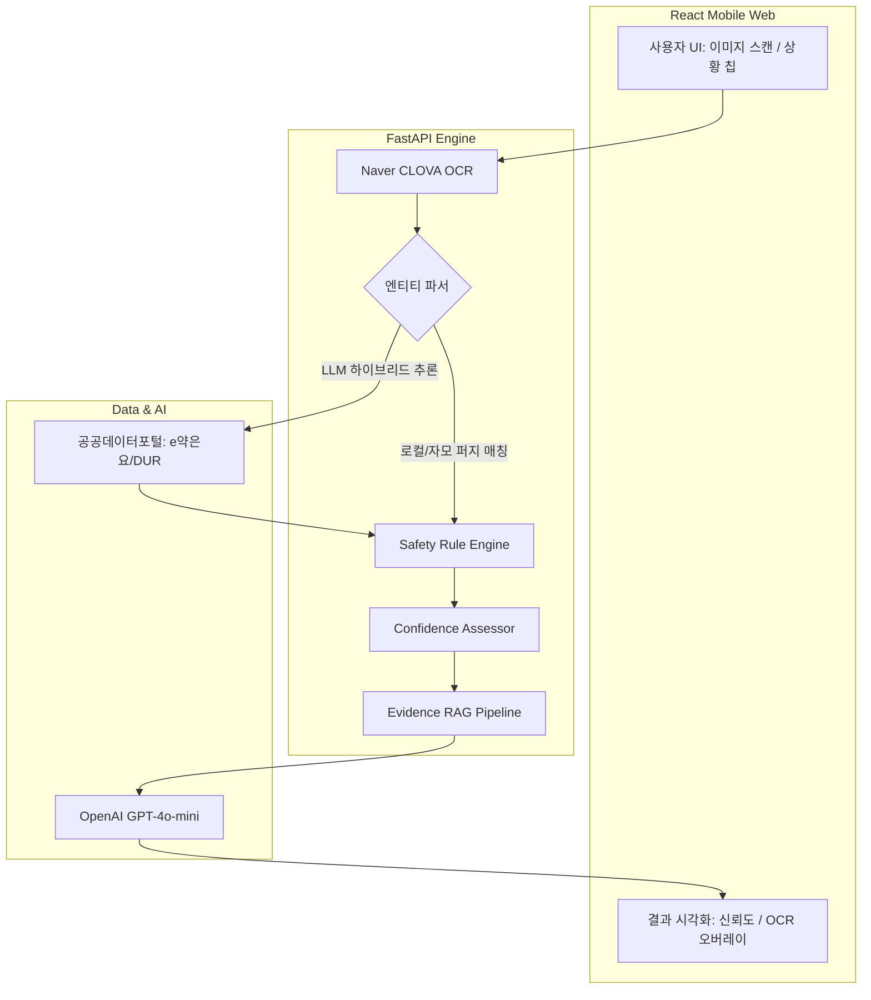

# 세이프잇 (SafeEat)
> **개인 맞춤형 식품·복약 안전 가드레일**

## 1. 브랜드명 및 의미
- **SafeEat**은 'Safe(안전한)'와 'Eat(먹다)'의 합성어로, '안전한 먹거리'라는 직관적인 메시지를 전달합니다
- 사용자에게 개인 맞춤형 식품·복약 안전을 실시간으로 제공하는 AI 기반 서비스임을 명확히 합니다
- 친근하고 쉽게 기억되는 이름으로 브랜드 인지도 및 접근성을 강화합니다

## 2. 브랜드 컨셉 및 핵심 가치
- **개인 맞춤형 안전 먹거리 가드레일**: 복약 정보와 식품 성분을 AI로 분석해 위험도를 실시간 경고합니다
- **근거 기반 신뢰성 제공**: 위험 원인과 대체 식품을 투명한 근거와 함께 안내합니다
- **쉽고 친근한 사용자 경험**: 전문 용어 대신 일상 친화적 언어와 직관적 UI를 제공합니다
- **생활 속 건강 파트너**: 매 순간 건강한 선택을 도와주는 동반자 역할을 강조합니다

---

## 3. 사용자 페르소나 (User Persona)

### **김영순 여사님 (72세, 은퇴)**
> *"자꾸 깜빡하는데, 이거 먹어도 괜찮은 건지 누가 바로 알려주면 좋겠어."*
- **상태**: 10년째 고혈압과 당뇨를 앓고 계시며 관절염 약도 복용 중입니다
- **고민**: 좋아하는 음식이라도 약에 해가 될까 봐 불안하고, 최근 들어 깜빡하는 일이 늘어 걱정이 많습니다. 자녀들에게 부담을 주는 것 같아 미안해합니다
- **니즈**: 스마트폰 사용은 서툴지만, 간편하게 건강 정보를 확인하고 싶어 합니다

### **최지연 팀장님 (45세, IT 회사 마케팅 팀장)**
> *"멀리 계신 부모님이 식사는 잘 하시는지, 혹시 약이랑 같이 드시면 안 되는 걸 드시진 않는지 늘 걱정돼요."*
- **상태**: 회사 일과 육아, 그리고 친정 부모님 건강까지 챙기는 바쁜 워킹맘입니다
- **고민**: 주중에 부모님을 자주 찾아뵙기 어려운데, 부모님이 혼자 식사하실 때 문제가 생길까 봐 늘 불안합니다
- **니즈**: 부모님의 복약-식단 정보를 일일이 확인하기 어려운 상황에서, 부모님을 안전하게 지켜줄 수 있는 도구를 원합니다

---

## 프로젝트 개요

본 프로젝트는 **처방전 및 식품·건강기능식품 성분표를 분석하여** 약물–음식(또는 건강기능식품) 간 **잠재적인 상호작용 위험을 사전에 탐지**하고, 사용자에게 **예방 중심의 경고를 제공하는 AI 기반 가드레일 시스템**을 구축하는 것을 목표로 합니다

병의원 외 일상 환경에서 발생하는 복약·식단 충돌 사고는 **정보가 분산되어 있고 해석이 어렵기 때문에** 발생합니다. **세이프잇(SafeEat)**은 파편화된 정보를 연결·구조화하여 섭취 직전에 위험 여부를 간단히 확인하도록 돕습니다

> ⚠️ 본 시스템은 의료 진단, 처방, 치료 결정을 제공하지 않습니다

---

## 문제 정의

사용자는 병원에서 처방받은 약물과  
일상적으로 섭취하는 음식, 음료, 건강기능식품 간의 **충돌 위험을 직접 판단하기 어렵다**.

- 필요한 정보는 이미 존재함
  - 처방전
  - 약 봉투
  - 식품 및 건강기능식품 성분표
- 그러나 정보가
  - 전문 용어 위주로 제공되고
  - 서로 분산되어 있으며
  - 직관적인 비교가 어렵다

이로 인해 대부분의 사고는 **섭취 이후에야 인지**된다

본 프로젝트는 **사고 발생 이후 대응이 아닌, 사전 예방 중심의 가드레일 시스템**을 제안한다

---

## 주요 기능 (Technical Highlights)

- **AI 기반 정밀 분석 가드레일 (Hybrid Pipeline)**
  - **Jamo-aware Entity Recognition**: 한국어 특성을 고려한 **자모 분해기(Jamo Decomposer)**와 퍼지 매칭을 결합하여, OCR 판독 오류 및 오타에도 약물을 정확히 식별합니다. (예: "이브프로팬" → "이부프로펜")
  - **Confidence Score System**: 분석 결과의 신뢰도를 수치화(0-100%)하여 사용자에게 투명하게 공개하고, 신뢰도가 낮은 경우 사용자 확인 루프를 통해 안전성을 확보합니다.
  - **Rule-based & LLM Hybrid**: 50개 이상의 전문 복약 규칙(`ruleset.json`)과 LLM(`gpt-4o-mini`)의 유연한 설명을 결합하여 빠르고 정확하며 이해하기 쉬운 리포트를 제공합니다.
- **신뢰 중심 UX/UI**
  - **OCR Visual Overlay**: 스캔한 성분표 위에 탐지된 위험 성분을 RED/YELLOW/GREEN 박스로 시각화하여 "어떤 성분 때문에 위험한지" 즉각적으로 인지하게 돕습니다.
  - **Situation Chips Integration**: '공복', '음주', '탈수' 등 약물 대사에 결정적인 상황을 원클릭으로 반영하여 상황 맞춤형 위험을 정밀하게 탐지합니다.
- **공공 데이터 연동**
  - **Drug Discovery**: 식약처 'e약은요' API 및 DUR(의약품 안전사용 서비스) 정보를 실시간으로 크로스 체크하여 데이터의 객관성을 확보합니다.

---

## 시스템 아키텍처 (Architecture)



---

## 🛠 설치 및 실행 방법 (Quick Start)

본 프로젝트는 고정밀 OCR 및 LLM 기능을 위해 외부 API 연동이 필요합니다.

### 1. 환경 변수 설정
`backend/` 디렉토리에 `.env` 파일을 생성하고 아래 키들을 입력합니다.
```env
OPENAI_API_KEY=your_openai_api_key
CLOVA_OCR_API_URL=your_clova_ocr_url
CLOVA_OCR_SECRET=your_clova_ocr_secret
DATA_GO_KR_API_KEY=your_public_data_api_key
```

### 2. 서버 실행
**Backend (FastAPI)**
```bash
cd backend
pip install -r requirements.txt
python app.py
```

**Frontend (React/Vite)**
```bash
cd frontend
npm install
npm run dev
```

---

## 기술 스택

- **Frontend**: React, Vite, Tailwind CSS, Lucide React, Framer Motion, Recharts, Sonner
- **Backend**: Python 3.11+, FastAPI, Uvicorn, LangChain, LangGraph, RapidFuzz
- **AI/LLM**: OpenAI GPT-4o-mini, Naver CLOVA OCR
- **Data Source**: 식약처 의약품개요정보(e약은요), DUR 상호작용 정보

---

## 실행 방법

### 1. 백엔드 서버 실행
```bash
cd backend
python app.py
```
*서버는 기본적으로 `http://localhost:8000`에서 실행됩니다.*

### 2. 프론트엔드 개발 서버 실행
```bash
cd frontend
npm run dev
```
*브라우저에서 안내되는 주소(보통 `http://localhost:5173`)로 접속하세요.*

---

## 프로젝트 로드맵 (Roadmap)

### ✅ Phase 1: MVP 기초 구축 (완료)
- [x] 약물/식품 엔터티 추출 엔진 개발
- [x] 룰 기반 위험도 평가 로직 구현
- [x] 모바일 친화적인 결과 페이지 UI 제작

### ✅ Phase 2: 신뢰도 및 비주얼 고도화 (완료 🔥)
- [x] **고정밀 OCR 통합**: CLOVA OCR 연동 및 이미지 리사이징 최적화
- [x] **OCR Visual Overlay**: 이미지 내 성분 바운딩 박스 시각화
- [x] **안정망(Safety Net) 구축**: 퍼지 매칭 및 약물 계열(Category) 매칭 로직 보강
- [x] **주간 안심 리포트**: 통계 기반 보호자 보고 시스템 및 유저 메시징

### 🚀 Phase 3: 운영 안정화 및 확장 (진행 중)
- [ ] **분석 결과 공유**: 결과 페이지 이미지/PDF 파일 저장 및 전송 기능
- [ ] **PWA 서비스**: 설치형 웹 앱 지원 및 오프라인 접근성 향상
- [ ] **식단 연동**: 일일 영양 섭취 정보와 복합 분석 기능 확장

---

## Disclaimer

본 시스템은 의료적 진단이나 처방을 제공하지 않으며 참고용 정보 제공 및 사고 예방 목적의 가드레일 시스템입니다 의학적 판단이 필요한 경우 반드시 전문가와 상담해야 합니다

